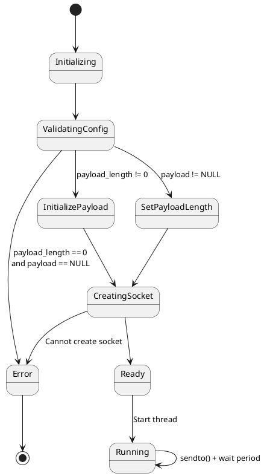
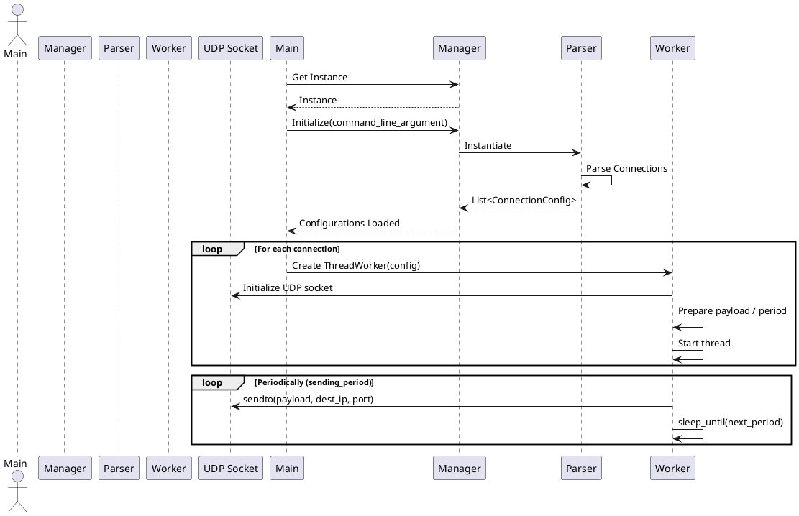

## Initialization Flow

```plantuml
@startuml Initialization Flow
[*] --> Initializing

Initializing --> ValidatingConfig
ValidatingConfig --> Error : payload_length == 0\nand payload == NULL
ValidatingConfig --> InitializePayload : payload_length != 0
ValidatingConfig --> SetPayloadLength : payload != NULL
SetPayloadLength --> CreatingSocket
InitializePayload --> CreatingSocket

CreatingSocket --> Error : Cannot create socket
CreatingSocket --> Ready

Ready --> Running : Start thread
Running --> Running : sendto() + wait period

Error --> [*]
@enduml
```

## Initialization Sequence

```plantuml
@startuml Initialization Sequence
actor Main as udptestutility
participant Manager as ConfigurationManager
participant Parser as IniFileParser
participant Worker as ThreadWorker
participant Socket as "UDP Socket"

Main -> Manager: Get Instance
Manager --> Main: Instance
Main -> Manager: Initialize(command_line_argument)
Manager -> Parser: Instantiate
Parser -> Parser: Parse Connections
Parser --> Manager: List<ConnectionConfig>
Manager --> Main: Configurations Loaded

loop For each connection
    Main -> Worker: Create ThreadWorker(config)
    Worker -> Socket: Initialize UDP socket
    Worker -> Worker: Prepare payload / period
    Worker -> Worker: Start thread
end

loop Periodically (sending_period)
    Worker -> Socket: sendto(payload, dest_ip, port)
    Worker -> Worker: sleep_until(next_period)
end
@enduml
```
